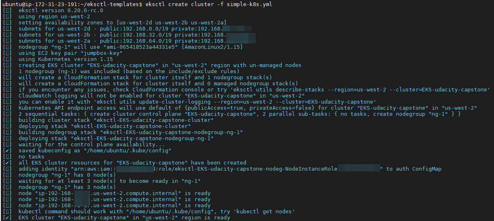

### About Project:

I created a CI/CD pipeline using Jenkins, to automate the whole workflow of code linting, packaging, containerizing and uploading. At last Jenkins will trigger a automated deployment to AWS EKS cluster, using rolling update deployment strategy.


### Project Tasks:

- Working in AWS
- Using Jenkins to implement Continuous Integration and Continuous Deployment
- Building pipelines
- Working with CloudFormation to deploy clusters
- Building Kubernetes clusters
- Building Docker containers in pipelines

### Project Structure:

```
Dockerfile: A multi-steps docker image build, including production code build, nginx integration and dockerization.

Jenkinsfile: For Jenkins pipeline

/k8s: scripts for AWS EKS deployment using rolling update strategy.

/eksctl: script for initial setup of the AWS EKS Cluster.

/playbooks: simple playbook to trigger EKS update.

other: code for frontend project.
```

### Project Setup

1. setup AWS cluster. The Kubernetes cluster initialization will be done by hand. Below script will create 3 nodes in `us-west-2` region across 3 AZs.

simple-k8s.yml

```yml
apiVersion: eksctl.io/v1alpha5
kind: ClusterConfig

metadata:
  name: EKS-udacity-capstone
  region: us-west-2

nodeGroups:
  - name: ng-1
    minSize: 3
    maxSize: 3
    instanceType: t2.small
    ssh:
      publicKeyName: jumpbox-key
```

Run `eksctl create cluster -f simple-k8s.yml`



To verify nodes are successfully created.


To check the node’s public IP address, run the following command:

```sh
kubectl get nodes -o wide |  awk {'print $1" " $2 " " $7'} | column -t
```

You will receive output like below:

```
NAME                                         STATUS  EXTERNAL-IP
ip-192-168-x-x.us-west-2.compute.internal  Ready   34.212.x.x
ip-192-168-x-x.us-west-2.compute.internal  Ready   52.12.x.x
ip-192-168-x-x.us-west-2.compute.internal  Ready   54.185.x.x

```

2. Trigger auto deployment via Jenkins Pipeline.

client-deployment.yml

```yml
apiVersion: apps/v1
kind: Deployment
metadata:
  name: web
  namespace: default
spec:
  replicas: 3
  selector:
    matchLabels:
      component: web
  strategy:
    rollingUpdate:
      maxSurge: 25%
      maxUnavailable: 25%
    type: RollingUpdate
  template:
    metadata:
      labels:
        component: web
    spec:
      containers:
        - image: isdance/client:v-43
          imagePullPolicy: IfNotPresent
          name: web
          ports:
            - containerPort: 80
              protocol: TCP
```

To verify the pods are created, run:

```sh
kubectl get pods -l 'component=web' -o wide | awk {'print $1" " $3 " " $6'} | column -t
```

You will receive output like below:

```
NAME                  STATUS   IP
web-76957b9d64-97rnp  Running  192.168.93.x
web-76957b9d64-hnt6k  Running  192.168.52.x
web-76957b9d64-pnz4r  Running  192.168.62.x
```

For the _first time only_, you will need to create a service, to expose your pods to public

```sh
#!bin/bash

kubectl expose deployment web  --type=LoadBalancer  --name=web-service
```

To get information about the `web-service` we just created, run the following command:

```sh
kubectl get service/web-service |  awk {'print $1" " $2 " " $4 " " $5'} | column -t
```

You will receive output like below:

```
NAME         TYPE          EXTERNAL-IP                                                            PORT(S)
web-service  LoadBalancer  a528da2b19cb04cfc9a4abb0c7ace4ff-xxxxxxxxx.us-west-2.elb.amazonaws.com  80:31211/TCP
```

AWS will create loadBalancer and listener for us:

Load balancer has 3 healthy nodes:


Listener created and forwarding traffics:


3. 